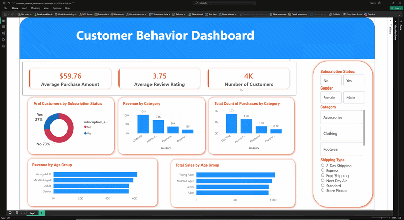

# Consumer Shopping Patterns:
"How can the company leverage consumer shopping data to identify trends, improve customer engagement, and optimize marketing and product strategies?”

# Tools Used:
- Used Python to perform data cleaning and modeling for analysis.
- Used SQL to organize the data in structured format to extract insight on the data.
- Used Power BI summarize the findings with interactive visualization.

# Dataset:
- Customer ID: IntVar - Primary Key
- Age: IntVar - age of each customer
- Gender: StringVar - gender for each customer (Male or Female)
- Item Purchased: StringVar - item purchased for each customer.
- Category: StringVar - shopping category the customer made a purchase in
- Purchase Amount (USD): IntVar - amount in usd of item purchased
- Location: StringVar - the U.S. State the customer shops in
- Size: CharVar - the size of the item purchased
- Season: StringVar - the season the customer made a purchase in
- Review Rating: FloatVar - the review score of the item
- Subscription Status: StringVar/Boolean - yes/no if customer has subscription
- Shipping Type: StringVar - type of shipping customer had for the item
- Discount Applied: StringVar/Boolean - yes/no if customer purchased discounted item.
- Promo Code Used: StringVar/Boolean - yes/no if customer applied promo code
- Previous Purchases: IntVar - total number of previous purchases by customer
- Payment Method: StringVar - the type of payment method applied
- Frequency of Purchases: StringVar - how frequently the customer shops 

# Interactive Dashboard:

